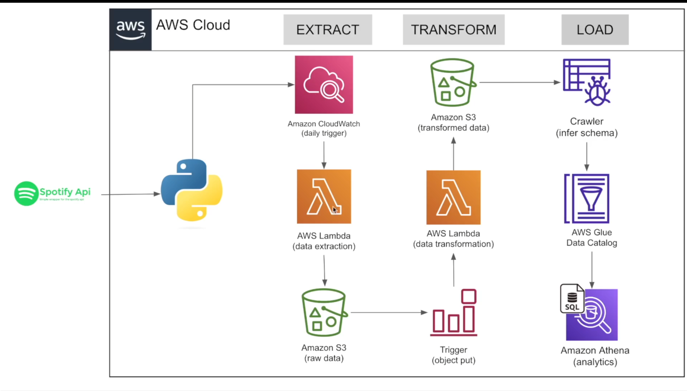

# 🎵 Spotify ETL Pipeline on AWS

An automated ETL data pipeline that extracts playlist data from the Spotify Web API, transforms the raw data into structured datasets, stores the results in Amazon S3, and makes the data queryable using AWS Glue and Amazon Athena.

The pipeline runs automatically on a daily schedule using Amazon CloudWatch/EventBridge and uses an event-driven workflow to trigger data transformation when new raw data arrives in S3.

## Architecture



### Pipeline Flow

```text
Spotify Web API
      ↓
AWS Lambda - Extract
      ↓
Amazon S3 - Raw Data
      ↓
S3 Object Trigger
      ↓
AWS Lambda - Transform
      ↓
Amazon S3 - Transformed Data
      ↓
AWS Glue Crawler
      ↓
AWS Glue Data Catalog
      ↓
Amazon Athena
```

## 🛠️ Technologies Used

- **Python** – extraction and transformation logic
- **Spotify Web API** – source data
- **Spotify OAuth 2.0** – authenticated API access
- **AWS Lambda** – serverless extraction and transformation
- **Amazon S3** – raw and transformed data storage
- **Amazon CloudWatch / EventBridge** – scheduled pipeline execution
- **AWS Glue Crawler** – schema discovery
- **AWS Glue Data Catalog** – metadata/catalog management
- **Amazon Athena** – SQL analytics
- **Pandas** – data transformation and CSV generation
- **Boto3** – interaction with AWS services

## ⚙️ How the Pipeline Works

### 1. Extract

The extraction Lambda function authenticates with the Spotify Web API using OAuth 2.0.

A refresh token is securely provided to the Lambda function, which exchanges it for a short-lived access token before requesting playlist data from Spotify.

The extracted JSON response is stored in Amazon S3 under a raw-data prefix.

```text
Spotify API
     ↓
OAuth Refresh Token
     ↓
Access Token
     ↓
Lambda
     ↓
S3 Raw Data
```

Raw files are stored using timestamped filenames to preserve each extraction.

Example:

```text
raw_data/
├── to_processed/
│   └── spotify_raw_20260919_210000.json
└── processed/
```

### 2. Automated Scheduling

Amazon CloudWatch/EventBridge triggers the extraction Lambda on a daily schedule.

This removes the need to manually execute the pipeline and allows new Spotify data to be collected automatically.

```text
Daily Schedule
      ↓
CloudWatch / EventBridge
      ↓
Extraction Lambda
```

### 3. Transform

When a new JSON object is created in the raw-data S3 location, an S3 object-created event triggers the transformation Lambda.

The transformation function reads the raw Spotify JSON and creates three structured datasets:

**Albums**

```text
album_id
album_name
album_release_date
album_total_tracks
album_url
```

**Artists**

```text
artist_id
artist_name
artist_url
```

**Songs**

```text
song_id
song_name
song_duration
song_url
song_added
album_id
artist_id
```

Pandas is used to:

- Convert JSON data into DataFrames
- Remove duplicate albums
- Remove duplicate artists
- Convert date fields into appropriate datetime formats
- Generate structured CSV files

### 4. Store Transformed Data

The transformed datasets are written back to Amazon S3 in separate locations.

```text
transformed_data/
├── album_data/
│   └── album_transformed_YYYYMMDD_HHMMSS.csv
│
├── artist_data/
│   └── artist_transformed_YYYYMMDD_HHMMSS.csv
│
└── songs_data/
    └── song_transformed_YYYYMMDD_HHMMSS.csv
```

After successful transformation, processed raw JSON files are moved from:

```text
raw_data/to_processed/
```

to:

```text
raw_data/processed/
```

This prevents previously processed files from being processed again and preserves the original raw data.

### 5. Data Cataloging

An AWS Glue Crawler scans the transformed S3 datasets and automatically infers their schemas.

The discovered metadata is registered in the AWS Glue Data Catalog, making the S3 data available as structured tables.

```text
S3 Transformed Data
        ↓
AWS Glue Crawler
        ↓
AWS Glue Data Catalog
```

### 6. Analytics with Athena

Amazon Athena uses the Glue Data Catalog to query the transformed Spotify datasets directly from S3 using SQL.

Example:

```sql
SELECT
    artist_name,
    COUNT(*) AS song_count
FROM songs
JOIN artists
    ON songs.artist_id = artists.artist_id
GROUP BY artist_name
ORDER BY song_count DESC;
```

This provides a serverless analytics layer without requiring a traditional database.

## 📁 Project Structure

```text
spotify-etl-aws/
│
├── lambda/
│   ├── spotify_extract.py
│   └── spotify_transform.py
│
├── images/
│   └── spotify-etl-architecture.png
│
├── README.md
└── .gitignore
```

## 🔐 Security

Sensitive Spotify credentials are not stored directly in the source code.

The following values are provided to the Lambda environment at runtime:

```text
client_id
client_secret
redirect_uri
refresh_token
```

Secrets and authentication tokens are excluded from version control.

> For a production implementation, sensitive credentials can be stored in AWS Secrets Manager rather than directly in Lambda environment variables.

## 💡 Key Engineering Concepts Demonstrated

This project demonstrates several core data engineering concepts:

- Building an end-to-end **ETL pipeline**
- Working with **REST APIs and OAuth 2.0**
- Serverless data processing with **AWS Lambda**
- **Event-driven architecture** using S3 triggers
- Automated pipeline execution using scheduled events
- Separating **raw and transformed data layers**
- Maintaining processed-file state to prevent reprocessing
- Data cleaning and transformation with Pandas
- Schema discovery and metadata management with AWS Glue
- Querying S3 data using serverless SQL with Amazon Athena
- Managing cloud credentials and application secrets

## 🚀 Future Improvements

Potential improvements to the pipeline include:

- Store Spotify credentials in **AWS Secrets Manager**
- Add API pagination to support larger playlists
- Add structured logging and error handling
- Configure retry logic and dead-letter queues for failed Lambda executions
- Convert transformed datasets from CSV to **Parquet** for more efficient Athena queries
- Partition S3 data by extraction date
- Add data quality checks before loading transformed data
- Add infrastructure-as-code using Terraform or AWS CloudFormation
- Add CI/CD deployment through GitHub Actions

## 📊 Summary

This project implements a fully automated, serverless Spotify ETL pipeline on AWS.

Spotify playlist data is extracted through the Spotify Web API, stored in a raw S3 layer, transformed into album, artist, and song datasets, cataloged using AWS Glue, and made available for SQL analysis through Amazon Athena.

The architecture combines scheduled extraction with event-driven transformation, allowing the pipeline to operate automatically with minimal manual intervention.